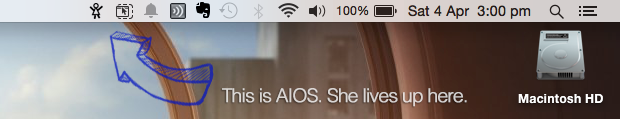
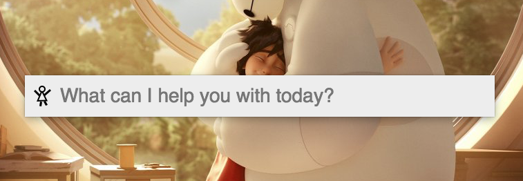

# AIOS

A personal assistant that can learn anything you want. Teach her commands through natural language and watch her automate your computer using computer vision.

AIOS is an automation program that allows users to speak to their computers in natural language, teach it high level commands and automate complex tasks. AIOS utilises the openCV computer vision library to recognise images on the screen, so she can dynamically interact with any user interface and wait for programs/websites to load.

Very soon you will be able to share and download automation ‘packages’ so that AIOS can learn skills in any of your favourite applications from an online community. Shortly after, you will be able to send AIOS commands from your phone, perhaps asking her to send you a file or maybe start downloading a movie for when you get home.

##How It Works

This is AIOS. She sits up here.

When you poke her, she'll ask if she can help with anything.

**Here’s an example dialog of someone teaching her something new:**

**User:** send an email to kate@gmail.com with the subject Cat Videos! and the message Help! Where can I find some??

**AIOS:** I don’t know how to do that! Would you like to teach me?

**User:** yes

**AIOS:** What is the format of this command?

**User:** send an email to ? with the subject ? and the message ?  
*(The question marks are arguments that can be used within the command)*

**AIOS:** What action should I perform first?

**User:** open my inbox

**AIOS:** I don’t know how to do this either. Would you like to teach me this at the same time?

**User:** yes  
*(You can teach AIOS multiple commands at the same time, so that subgoals can be reused later)*

**User:** What is the format of this command?

**User:** open my inbox  
*(This command doesn't have any arguments)*

**AIOS:** What action should I perform first?

**User:** load website gmail.com  
*(Let’s pretend 'load website ?' is a command you've previously taught her. It may include opening Firefox, waiting for it to load, clicking new tab, clicking the url bar, typing the specified website and pressing enter)*

**User:** wait until the gmail icon is visible  
*(This is telling AIOS to pause at this step until she sees the gmail icon, hence, wait until the webpage has loaded. It doesn't matter if she hasn’t been taught what 'the gmail icon’ looks like yet, we will teach her this the first time she performs this command)*

**User:** done

**AIOS:** New command learnt. What shall I perform next?  
*(AIOS has now learnt the command ‘open gmail’ and we are now continuing to teach her how to send emails)*

**User:** click compose email  
**User:** wait until new email box is visible  
**User:** type ?1  
*(This will type the first argument in the command - the email address)*  
**User:** click subject  
**User:** type ?2  
*(This will type the subject)*  
**User:** press tab  
**User:** type ?3  
*(This will type the message)*  
**User:** press enter  
**User:** done  

**AIOS:** New command learnt! What else can I help you with today?

##How To Install

The first stand-alone version will be released very shortly. In the meantime, you can build it from source using the instructions below.

###Compatibility  
It currently only works on **Mac OSX**, but will be ported to Windows and Linux systems soon. Feel free to contribute to the project and help speed up the process! It should be a pretty straight forward to achieve, there's an explanation of what needs to be implemented in the Issues section. We just need to implement native control functions such as click, press keyboard buttons, take screenshots etc..

###Requirements  
[gcc](https://gcc.gnu.org/)  
[openCV - Open Source Computer Vision](http://opencv.org/)  
[Qt](http://www.qt.io/) (only required for GUI, you can build a command-line version without it)

###Installation  
Hopefully you can just open '/src/Aios.pro' in Qt and press build. This is a brand new project that hasn't been tested on many systems yet, so if you have any issues please let me know!

##Documentation

You can create a new automation by typing **new command**.

Alternatively, if you type something that AIOS does not recognise, she'll ask if you'd like to create a new command.

Once you have finished listing actions to be performed within an automation, type **done** to save this command or **cancel** to return to the default state.

**The following commands can be used as building blocks for your automations:**

Command | Description
--- | --- 
**click ?** | This will find a specified image on the screen, move the mouse to this position and then left click  
**press ?** | This will press a specified keyboard button such as enter, space, escape etc.  
**type ?**  | This will press a series keyboard buttons to type a specified output (escape characters such as \n and \t also work) 
**system ?** | This will run a terminal command (or command prompt for Windows users)  
**say ?** | This will use the native OS speech synthesis functionality to speak outloud  
**find ?** | This will find a specified image on the screen and move the mouse to this position  
**follow ?** | This will find a specified image on the screen and ensure the mouse stays above it  
**wait ? seconds** | This will pause AIOS for a specified amount of seconds  
**wait until ? is visible** | This will pause AIOS until a specified image appears on the screen
**showGUI** | This will make the AIOS GUI visible. This may be a desired feature in 'presentation mode'.  
**hideGUI** | This will hide the AIOS GUI visible.

**The following commands can be used to add conditions and repeats to your automations:**

Command | Description
--- | --- 
**if ? is visible** | The following set of commands will only run if the specified image is visible.  
**if ? is not visible** | The following set of commands will only run if the specified image is **not** visible.  
**repeat for ? seconds** | The following set of commands will be repeatedly ran for a specified amount of seconds.  
**repeat ? times** | The following set of commands will be repeatedly ran for a specified amount times.  
**while ? is visible** | The following set of commands will be repeatedly ran whilst a specified image is visible.

##Contribution

I'm pretty excited about this project, and would love to see more people working on it. The best way to contribute is to head to the issues section, and work through any of the listed items there. 

Otherwise, if you have any ideas or suggestions please email me at brett.hodgkins@gmail.com
